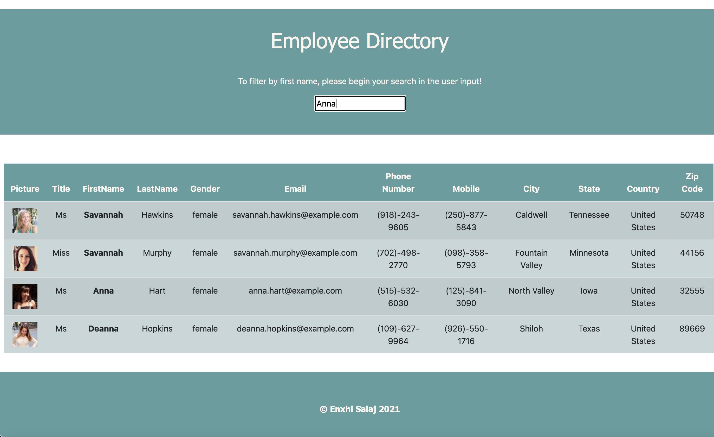

# Employee-Directory

## Description
  * This application, is a employee directory with React. 
  * This project was bootstrapped with [Create React App](https://github.com/facebook/create-react-app).
  * Given a table of random users generated from the [Random User API](https://randomuser.me/), 
  when the user loads the page, a table of employees renders. 
  

## Table of Content
  1. [Usage](#usage)
  2. [Technology](#technology)
  3. [Installation](#installation)
  4. [Image](#image)
  5. [Links](#links)
  6. [Contribution](#contribution)
  7. [Licence](#licence)
  8. [Questions](#questions)
  
## Usage
  * As a user, I want to be able to view my entire employee directory at once so that I have quick access to their information.
  
## Technology
  This application with the following technologies:
  * React
  * Bootstrap
  * Random User API

## Installation
  `npm start`

  Runs the app in the development mode.\
  Open [http://localhost:3000](http://localhost:3000) to view it in the browser.
  The page will reload if you make edits.\
  You will also see any lint errors in the console.
  
## Image

## Links
  * Deployed link to Heroku: https://employee-directory-enxhis.herokuapp.com/
  * GitHub repository link:  https://github.com/Enxhis/Employee-Directory

## Contribution
  * Enxhi Salaj

## Licence
  
  
## Questions
  * If you have questions, email me at: enxhi_salaj@yahoo.com,
  * GitHub Profile link: https://github.com/Enxhis

